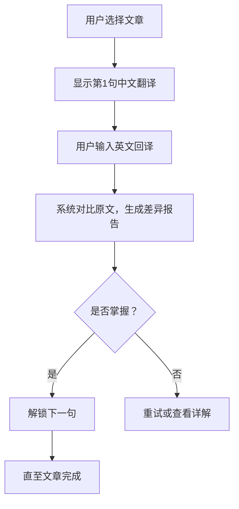

以下是为 **EchoLingo** 设计的阶段性需求文档，基于核心功能“回译练习”逐步扩展，分**MVP阶段（最小可行产品）**、**V1阶段（核心功能完善）**、**V2阶段（扩展与生态）** 推进。文档严格遵循“场景驱动、渐进迭代”原则，引用行业需求文档最佳实践。

---

# EchoLingo 需求文档  
> **产品定位**：通过AI驱动的回译训练，帮助中高阶英语学习者突破表达瓶颈，实现从“翻译思维”到“母语思维”的跃迁。  

---

## 一、MVP阶段：最小可行产品（2025 Q3）  
**目标**：验证核心回译流程的有效性与用户留存率，覆盖基础学习闭环。  

### 1. 核心功能范围  
| 模块                | 功能点                     | 优先级 |  
|---------------------|----------------------------|--------|  
| **文章学习流**      | 用户选择文章（预设10篇）   | P0     |  
|                     | 分句展示中文翻译 → 用户回译英文 → 系统对比原文 | P0     |  
| **差异分析引擎**    | 语法错误标记（时态/主谓一致等） | P0     |  
|                     | 词汇替换建议（近义词辨析）    | P1     |  
|                     | 结构差异高亮（从句/被动语态） | P1     |  
| **用户进度管理**    | 句级学习状态（未学/进行中/已掌握） | P0     |  
|                     | 文章完成度统计              | P1     |  

### 2. 关键用户场景与流程  


### 3. 技术实现要点  
- **差异分析**：集成规则引擎（时态/语态） + OpenAI API（语义相似度计算）  
- **数据存储**：用户进度本地缓存 + 云端同步（Firebase基础版）  
- **性能指标**：响应延迟 < 1.5秒（90%请求）  

---

## 二、V1阶段：核心功能完善（2025 Q4）  
**目标**：提升反馈深度与个性化能力，增加用户黏性，DAU提升40%。  

### 1. 增强功能模块  
| 模块                | 新增功能点                  | 用户价值               |  
|---------------------|----------------------------|------------------------|  
| **多维度反馈系统**  | “地道表达”红榜（原文亮点标注） | 强化正向激励  |  
|                     | 错误归因分析（e.g., “中式英语”） | 针对性改进建议         |  
|                     | 发音对比（TTS朗读原文 vs 用户录音） | 听说联动               |  
| **难度自适应**      | 文章分级（CEFR A2-C1）      | 匹配用户水平  |  
|                     | 动态句子排序（按错误率调整后续句子难度） | 减少挫败感             |  
| **学习报告**        | 错题本（按错误类型归类）      | 针对性复习    |  
|                     | 周报（薄弱点统计 + 进步曲线） | 成就感可视化           |  

### 2. 核心场景扩展  
- **复习场景**：用户可在错题本中重做高错误率句子，系统推送相似句式巩固练习  
- **挑战场景**：限时回译模式（10秒/句），训练快速反应能力  

### 3. 技术升级  
- **自适应引擎**：基于隐马尔可夫模型（HMM）预测用户能力变化曲线  
- **语音处理**：集成Web Speech API实现实时录音评分  
- **埋点设计**：  
  ```markdown  
  - 事件：`sentence_retry`（重试次数）、`hint_used`（提示使用）  
  - 指标：句子掌握耗时、错误类型分布  
  ```  

---

## 三、V2阶段：生态扩展（2026 Q1）  
**目标**：构建“内容-社区-服务”生态，探索商业化路径。  

### 1. 生态功能架构  
```  
EchoLingo Ecosystem  
├── **内容平台**  
│    ├── UGC文库（用户上传文章，AI审核质量）  
│    └── 出版社合作（牛津/剑桥分级读物接入）  
├── **学习社区**  
│    ├── 表达挑战赛（每周主题回译PK）  
│    └── 优质答案众评（用户互评回译结果）  
└── **服务扩展**  
     ├── 教师端（班级进度看板 + 错题集导出）  
     └── API开放（接入教育机构SaaS系统）  
```  

### 2. 关键特性说明  
- **UGC内容审核**：  
  - 步骤1：用户提交文章 → AI检测语言复杂度（Flesch-Kincaid指数）  
  - 步骤2：人工审核员抽样校验（平台签约语言专家）  
- **表达挑战赛规则**：  
  - 每日1题，用户回译后匿名互评（5分制）  
  - 积分榜TOP 10获“地道表达”认证徽章  

### 3. 商业化设计  
| 模式         | 策略                      | 预期LTV提升 |  
|--------------|---------------------------|-------------|  
| **Freemium** | 基础回译免费，高级报告付费 | 25%         |  
| **B2B2C**    | 学校采购班级账号           | 40%         |  
| **数据服务** | 向出版社提供脱敏学习行为分析 | 15%         |  

---

## 四、附录  
### 1. 数据埋点清单（V1阶段部分）  
| 事件ID             | 触发条件                 | 采集字段                     |  
|---------------------|--------------------------|------------------------------|  
| `sentence_start`    | 用户进入新句子           | sentence_id, article_level   |  
| `translation_submit`| 提交回译答案             | user_text, time_spent        |  
| `error_click`       | 点击错误分析条目         | error_type（语法/词汇/结构） |  

### 2. 竞品对标策略  
- **差异点强化**：  
  -  vs Duolingo：放弃碎片化游戏化，专注深度输出训练  
  -  vs Grammarly：从纠错扩展到“地道性生成”  

---

**文档修订记录**  
- 2025-06-11 (v0.1)：MVP框架确认（产品组 @Alex）  
- 2025-06-15 (v0.2)：新增V1埋点设计（技术组 @Jamie）  

> 下一步行动：原型验证（Figma交互稿） → 技术可行性评审 → 启动MVP开发。  
> 完整流程及界面规则详见：[EchoLingo功能需求详述](链接占位符) 。